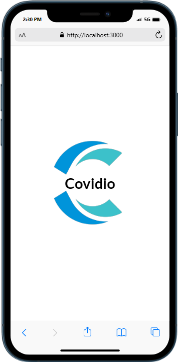
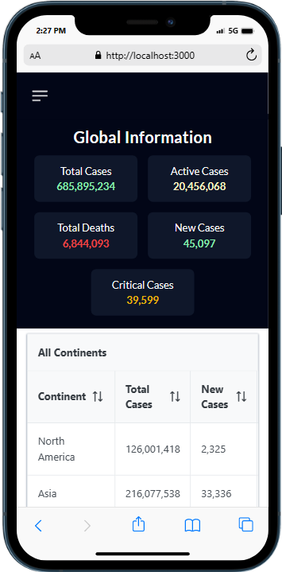
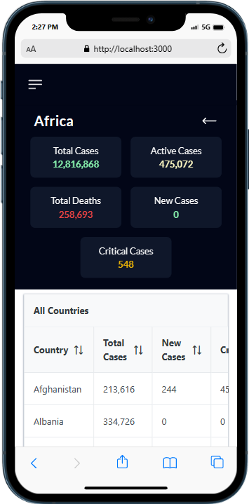
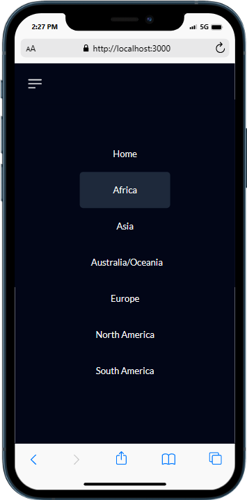

<a name="readme-top"></a>

<!-- TABLE OF CONTENTS -->

# 📗 Table of Contents

- [📖 About the Project](#about-project)
  - [🛠 Built With](#built-with)
    - [Tech Stack](#tech-stack)
    - [Key Features](#key-features)
  - [🖼️ScreenShot](#screenshot)
  - [🚀 Live Demo](#live-demo)
- [💻 Getting Started](#getting-started)
  - [Setup](#setup)
  - [Prerequisites](#prerequisites)
  - [Install](#install)
  - [Usage](#usage)
  - [Run tests](#run-tests)
  - [Deployment](#deployment)
- [👥 Authors](#authors)
- [🔭 Future Features](#future-features)
- [🤝 Contributing](#contributing)
- [⭐️ Show your support](#support)
- [🙏 Acknowledgements](#acknowledgements)
- [📝 License](#license)

<!-- PROJECT DESCRIPTION -->

# 📖 [Covido] <a name="about-project"></a>

Covido is an app designed to help users stay up-to-date on the latest COVID-19 statistics from around the world. The app features two main pages: the Dashboard and the Details page. It is built with Reactjs, PrimeReact and TailwindCSS. Here is a link to the live project overview [live demo](https://drive.google.com/file/d/17BvE2SK8XZ_zEzcVFOggaJAk7sB49_ow/view?usp=sharing)

## 🛠 Built With <a name="built-with"></a>

### Tech Stack <a name="tech-stack"></a>

- **ReactJS**
- **PrimeReact**
- **Tailwind CSS**

<!-- Features -->

### Key Features <a name="key-features"></a>

- **Navigation Bar**
- **Sidebar**
- **Splash Screen**
- **Dashboard**
- **Details Page**

<p align="right">(<a href="#readme-top">back to top</a>)</p>

## 🖼️ Screenshots <a name="screenshot"></a>






<p align="right">(<a href="#readme-top">back to top</a>)</p>

<!-- LIVE DEMO -->

## 🚀 Live Demo <a name="live-demo"></a>

- Here is the link to the live demo version - [Covidio](https://covidio.vercel.app)

<p align="right">(<a href="#readme-top">back to top</a>)</p>

<!-- GETTING STARTED -->

## 💻 Getting Started <a name="getting-started"></a>

To get a local copy up and running, follow these steps.

### Prerequisites

In order to run this project you need to install Node:

```sh
 Node.js
```

### Setup

Clone this repository to your desired folder:

```sh
  git clone git@github.com/Stephen-Adom/covidio.git
  cd covidio
```

### Install

Install this project with:

Example command:

```sh
  npm install
```

### Usage

To run the project, execute the following command:

```sh
  npm run start
```

### Run tests

To run tests, run the following command:

<!--
Example command:

```sh
  npm run test
```
--->


### Deployment

You can deploy this project using:

```sh
  Vercel, Netlify or Github Pages
```

<p align="right">(<a href="#readme-top">back to top</a>)</p>

<!-- AUTHORS -->

## 👥 Authors <a name="authors"></a>

👤 **Stephen Addae**

- GitHub: [@Stephen-Adom](https://github.com/Stephen-Adom)
- Twitter: [@stephen_alaska](https://twitter.com/stephen_alaska)
- LinkedIn: [Stephen Addae](https://www.linkedin.com/in/stephen-addae/)

<p align="right">(<a href="#readme-top">back to top</a>)</p>

<!-- FUTURE FEATURES -->

## 🔭 Future Features <a name="future-features"></a>

- **Desktop Screen Page**

<p align="right">(<a href="#readme-top">back to top</a>)</p>

<!-- CONTRIBUTING -->

## 🤝 Contributing <a name="contributing"></a>

Contributions, issues, and feature requests are welcome!

Feel free to check the [issues page](../../issues/).

<p align="right">(<a href="#readme-top">back to top</a>)</p>

<!-- SUPPORT -->

## ⭐️ Show your support <a name="support"></a>

If you like this project please give me a star⭐

<p align="right">(<a href="#readme-top">back to top</a>)</p>

<!-- ACKNOWLEDGEMENTS -->

## 🙏 Acknowledgments <a name="acknowledgements"></a>

I would like to thank [Nelson Sakwa on Behance](https://www.behance.net/sakwadesignstudio) for providing design guidelines and template for this project

<p align="right">(<a href="#readme-top">back to top</a>)</p>

<!-- LICENSE -->

## 📝 License <a name="license"></a>

This project is [MIT](./LICENSE) licensed.

<p align="right">(<a href="#readme-top">back to top</a>)</p>
